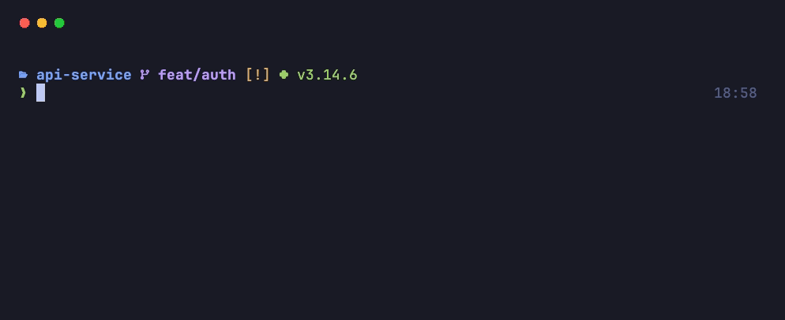
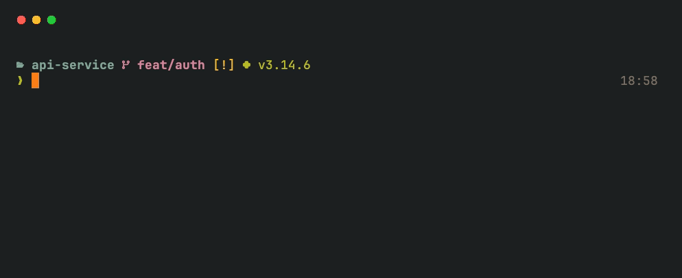
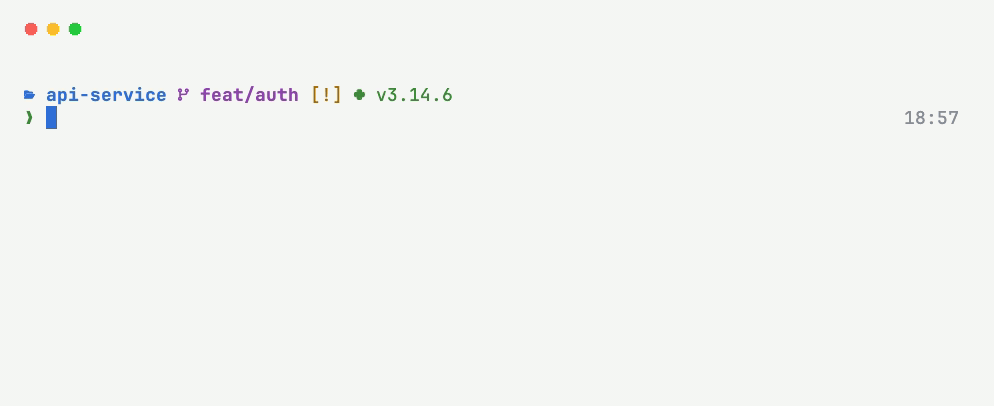

# devterm

Opinionated **Starship** setup for **iTerm2** and **macOS Terminal.app**, for
developers and SREs. Clone it, pick a theme, run one script — and get a terminal
that shows you what matters: git state, Kubernetes context, cloud profile,
language versions, and (in iTerm2) log errors highlighted as they scroll by.



## Prerequisites

- macOS with `zsh` (the default shell) and `git`
- [Homebrew](https://brew.sh) — the installer offers to install it if it's missing

Everything else is installed for you. The installer first lists what's already
there and what's missing, then asks once before installing anything:

```
==> Prerequisites
    ✓ iTerm2
    ✓ JetBrains Mono Nerd Font
    ○ Starship prompt — not installed
    ○ eza (ls with icons) — not installed

    To install:
      brew install starship
      brew install eza
    Install 2 missing item(s) now? [Y/n]
```

| Prerequisite             | Installed with                                      | Needed for                                    |
| ------------------------ | --------------------------------------------------- | --------------------------------------------- |
| iTerm2                   | `brew install --cask iterm2`                        | `--app iterm` or `all` only                   |
| JetBrains Mono Nerd Font | `brew install --cask font-jetbrains-mono-nerd-font` | icons in the prompt                           |
| Starship                 | `brew install starship`                             | the prompt                                    |
| eza _(optional)_         | `brew install eza`                                  | `ls` with icons — skip it with `--no-eza`     |

Prefer to install them yourself? Run with `--skip-brew`; the installer still prints the list.

## Quick start

**One command, no clone needed:**

```bash
bash -c "$(curl -fsSL https://raw.githubusercontent.com/sameeralam3127/devterm/main/install.sh)"
```

To pass options, pipe it into `bash -s --`:

```bash
curl -fsSL https://raw.githubusercontent.com/sameeralam3127/devterm/main/install.sh | bash -s -- --profile midnight --app terminal
```

This downloads the repo to `~/.devterm/src` and runs the installer from there.
Want to read the script first? Open the
[install.sh](https://github.com/sameeralam3127/devterm/blob/main/install.sh) link,
or clone the repo and add `--dry-run`:

```bash
git clone https://github.com/sameeralam3127/devterm.git
cd devterm
./install.sh --dry-run          # preview every change
./install.sh                    # iTerm2 + Terminal.app
./install.sh --app terminal     # only macOS Terminal.app (doesn't install iTerm2)
./install.sh --app iterm        # only iTerm2
```

The installer asks which profile you want and what font size to use, installs
what's missing, and backs up anything it replaces. Then pick the profile:

- **iTerm2** → Settings → Profiles → **devterm · &lt;Theme&gt;** → Other Actions → **Set as Default**
  _(optional: Settings → Appearance → General → Theme: Minimal)_
- **Terminal.app** → Settings → Profiles → **devterm · &lt;Theme&gt;** → **Default**

Or pass `--set-default` to do this for you. Then open a new tab.

## Profiles

| Profile    | Style                                                               | Preview                         |
| ---------- | ------------------------------------------------------------------- | ------------------------------- |
| `midnight` | Deep navy dark theme with soft blue/purple accents                  | [demo](docs/demo-midnight.gif)  |
| `ember`    | Warm retro dark theme, easy on the eyes for long sessions           | [demo](docs/demo-ember.gif)     |
| `daylight` | Clean high-contrast light theme for bright rooms and screen sharing | [demo](docs/demo-daylight.gif)  |

<details>
<summary>Show all three previews</summary>

**Midnight**


**Ember**



**Daylight**



</details>

Every profile shares the same features — only the colors change. You can install
more than one and switch between them.

## What you get

**iTerm2 profile** (`--app iterm`)

- JetBrains Mono Nerd Font (16pt by default) with ligatures and icons
- Status bar: current directory, git branch, host, CPU, memory, network, clock
- Log highlighting: `ERROR`/`FATAL`/`FAILED` in red; `WARN`/`CrashLoopBackOff`/`OOMKilled` in yellow; `Running`/`Ready`/`PASSED` in green
- Mac-style editing: ⌥←/→ by word, ⌘←/→ to line start/end, ⌥⌫ delete word, ⌘⌫ delete line
- ⌘-click a path like `app.py:42` to open it in your editor at that line
- New tabs open in the same directory; unlimited scrollback; shell integration

**Terminal.app profile** (`--app terminal`)

- Same colors, font, font size and line spacing as the iTerm2 profile
- Option key acts as Meta, so ⌥←/→ jump by word
- Status bar, log highlighting and ⌘-click to open files are iTerm2-only
- Needs macOS 26 or later for 24-bit color; on older macOS, use iTerm2

**Starship prompt** — context appears only where it's relevant:

| Module                       | Shown when                                                                                                                                            |
| ---------------------------- | ----------------------------------------------------------------------------------------------------------------------------------------------------- |
| Git branch & status          | inside a git repo                                                                                                                                     |
| Kubernetes context/namespace | in folders with `Chart.yaml`, `kustomization.yaml`, `k8s/`, `charts/`… (`docker-desktop` shows as a dim `local`; contexts containing `prod` turn red) |
| AWS profile/region           | `AWS_PROFILE` is set                                                                                                                                  |
| Terraform workspace          | `.tf` files present                                                                                                                                   |
| Ansible                      | `ansible.cfg`, `galaxy.yml`, `requirements.yml` present                                                                                               |
| Python version + venv        | Python project files present, or a venv is active                                                                                                     |
| Go / Node.js                 | matching project files present                                                                                                                        |
| Docker context               | `Dockerfile` / compose file present                                                                                                                   |
| Command duration             | a command took over 2s                                                                                                                                |

**Shell** — adds a managed block to `~/.zshrc` with the Starship init and
[eza](https://github.com/eza-community/eza) aliases (`ls`, `ll`, `la`, `lt`) with icons and git status.

## Options

```
./install.sh [options]

  -p, --profile NAME     Theme to install (see --list)
  -f, --font-size N      Terminal font size, 10–32 (default: 16)
  -a, --app APP          iterm, terminal (macOS Terminal.app) or all (default: all)
  -l, --list             List available profiles
      --set-default      Make the profile the default (for iTerm2, quit it first)
      --no-eza           Don't install eza or add the ls aliases
      --skip-brew        Don't install anything with Homebrew
  -n, --dry-run          Show what would change without changing anything
  -y, --yes              Don't ask for confirmation
```

Examples:

```bash
./install.sh --list
./install.sh -p midnight -f 18
./install.sh -p daylight --dry-run
./install.sh -p ember --yes --set-default     # run from Terminal.app with iTerm2 closed
./install.sh -p midnight --app terminal --set-default
```

## What it changes

| Path                                                                          | Change                                                                               |
| ----------------------------------------------------------------------------- | ------------------------------------------------------------------------------------ |
| `~/Library/Application Support/iTerm2/DynamicProfiles/devterm-<profile>.json` | iTerm2 dynamic profile (auto-loaded, live-reloaded)                                  |
| Terminal.app → Settings → Profiles                                            | A **devterm · &lt;Theme&gt;** profile (importing it opens one preview window)        |
| `~/.config/starship.toml`                                                     | Starship config — your existing one is backed up first                               |
| `~/.zshrc`                                                                    | One block between `# >>> devterm >>>` and `# <<< devterm <<<` — backed up first      |
| `~/.devterm/`                                                                 | Backups and install state                                                            |

Homebrew packages are installed only if missing — see [Prerequisites](#prerequisites).

Re-running the installer is safe: profiles and the shell block are replaced, not duplicated.

## Uninstall

```bash
./uninstall.sh            # removes profiles and shell block, restores your old starship.toml
./uninstall.sh --purge    # also deletes ~/.devterm backups
```

Installed with curl? The uninstaller is in `~/.devterm/src`:

```bash
~/.devterm/src/uninstall.sh
```

Homebrew packages are left installed; the script prints the command to remove them.

## Troubleshooting

**Icons show as boxes or `?`** — the Nerd Font isn't installed or selected.
Run `brew install --cask font-jetbrains-mono-nerd-font` and make sure you're using a devterm profile.

**"Dynamic profile … conflicts with non-dynamic profile with same Guid"** — you
imported a devterm JSON through _Settings → Import JSON_. Delete that copy in
_Settings → Profiles_; devterm profiles should only live in the `DynamicProfiles` folder.

**Terminal.app profile wasn't added** — the first run asks to let your terminal
control Terminal.app. If you declined, allow it in _System Settings → Privacy &
Security → Automation_ and rerun with `--app terminal`.

**Terminal.app colors look wrong** — Terminal.app supports 24-bit color only on
macOS 26 and later. On older macOS, use iTerm2.

**Prompt didn't change** — if you use Oh My Zsh, set `ZSH_THEME=""` in `~/.zshrc`,
and remove any other `starship init` lines. Then run `exec zsh`.

**Font too big/small** — rerun `./install.sh -p <profile> -f <size>`, or change
it in the app's profile settings.

## Adding a theme

Themes are small JSON files; the iTerm2 and Terminal.app profiles and the Starship config are generated from them.

1. Copy `themes/midnight.json` to `themes/<name>.json` and change the colors
   (`ansi` is the 16-color palette: 0–7 normal, 8–15 bright).
2. Run `python3 tools/build.py` — this writes `profiles/<name>/`.
3. Test with `./install.sh -p <name>`.
4. _(optional)_ Run `./tools/record-demo.sh` to record `docs/demo-<name>.gif`
   (needs `brew install vhs ffmpeg`).
5. Open a PR with the theme, the generated files and the GIF.

Shared prompt layout lives in `templates/starship.toml.tmpl`; terminal settings live in `tools/build.py`.
CI checks that generated files are up to date (`python3 tools/build.py --check`).

## Contributing

PRs are welcome — see [CONTRIBUTING.md](CONTRIBUTING.md). Every PR runs CI and
needs a maintainer's approval before merging. Report security issues privately
as described in [SECURITY.md](SECURITY.md).

## License

[MIT](LICENSE)
